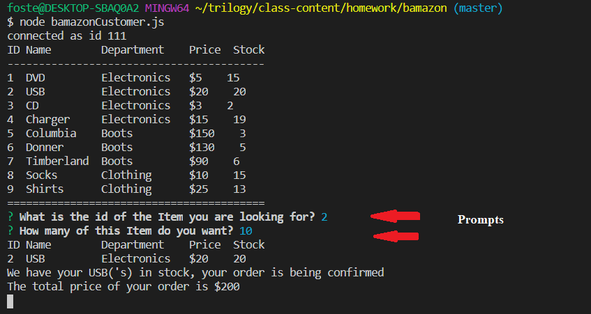
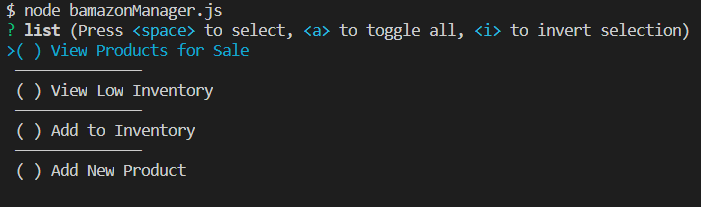
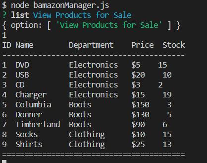
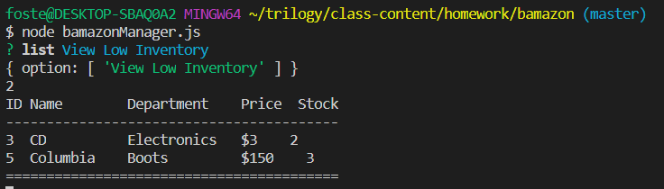
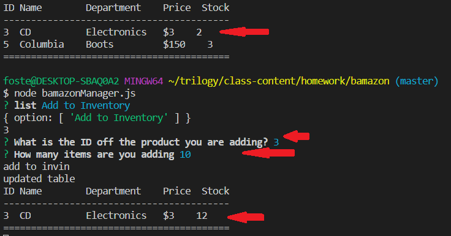
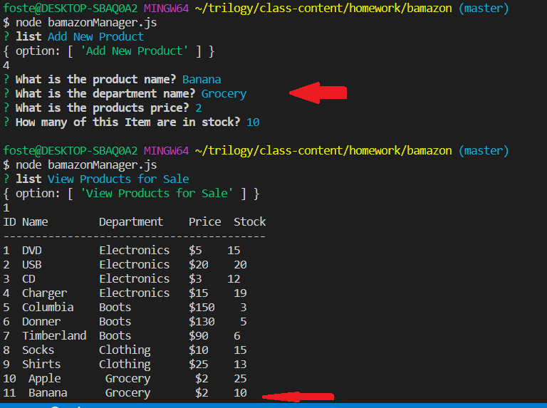

# Bamazon

**************************
## Basic Function  
This App can be used as a basic shopping model. It utilized node.js, docker and mysql to Select, update and isert into a database. Allowing a user to browse and choose items to buy, and a manager to check and manage invintory.

## App Parts

* 1: Part one is the bamazonCustomer js page. This page contains all of the node.js fram for the consumer side, giving the user the option to select and purchase goods.
* 2: Similar to the customer js file, bamazonManager.js gives a manager the option to check and update invintory using SELECT and UPDATE commands
* 3: the dateFormat.js containes a class used to format and print out the data from the sql server
* 4: The bamazon.sql file containes the initial sql code to get the database started and filled out.
* 5: Finally the docker-compose.yml file can be used for initializing and running the docker server which containes the mysql server and the node.js used in the app
  
 ## Instructions
* To run the app start with a  
    - node bamazonCustomer.js or bamazonManager.js
* If you chose customer you will be given a list of the available items and you can then select the item by its ID and select the quantity.  
  
* Next you will be told if there are enough items available.  

* on the manager side you will be given 4 options  

    - View available products  
    
    - View low inventory items  
    
    - add items to the inventory  
    
    - add a new product for sale  
    

## Links
* [Github Link](https://github.com/Fgailey/bamazon)

* [LinkedIn](https://www.linkedin.com/in/foster-gailey-391292165/)
